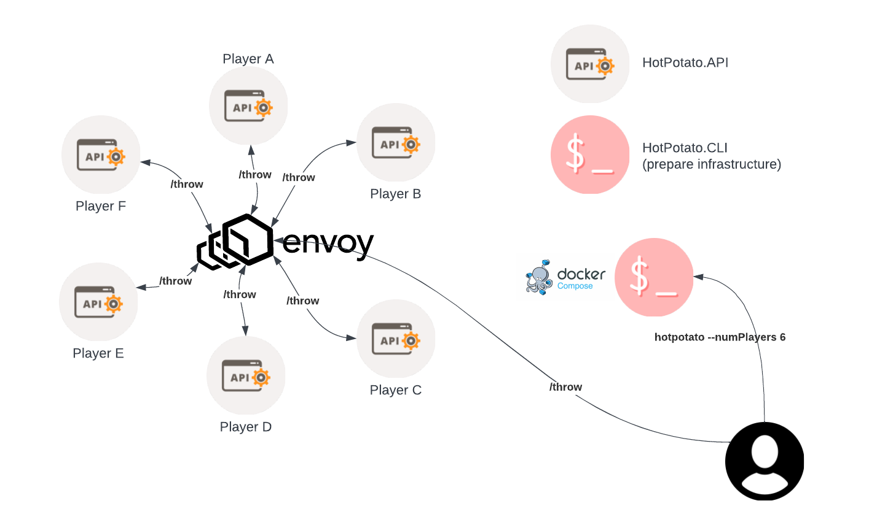

# Welcome to the Hot Potato Project!
## Purpose
Performance testing using a single API replicated several times and bouncing a potato between them before its dropped. The goal is to test several communication modes and understand their pros/cons and limitations.

Currently supported modes:
- Http with Envoy as a Proxy, configured in round robin



## Parameters
- NB_INSTANCES: number of instances to create for the test
- MODE: n/a
- ENVOY_PORT: port on which envoy will listen (for direct communication mode)

## List of commands

#### Generate docker compose stack file
```docker compose --file docker-compose.cli.yml up```

Note: see docker-compose.cli.yml to modify parameters before executing

#### Start stack
```docker compose --file docker-compose.stack.yml up -d```

#### Stop stack
```docker compose --file docker-compose.stack.yml stop```

## How to use
Once the stack is up, here's what you can do:

### Monitoring
You can access Grafana here: **localhost:3000**

**Logs**: the API is logging using serilog, with http requests logging activated. Logs are collected with the Grafana Agent and sent to Loki.
**Metrics**: the API provides its metrics on /metrics using the prometheus-net package. The API's metrics are labeled with appname=hotpotato. 
**Traces**: to come...

### Throw a potato
There are 2 ways to throw a potato:
- You can access the swagger endpoint by using the url **localhost:<ENVOY_PORT>/swagger/index.html** and throw a potato from there, or 
- Use you preferred tool and throw it from there at the url **localhost:<ENVOY_PORT>/Throw** (the call is a POST and has a body, see swagger documentation)

#### Throw parameters
- **Time to live**: number of times the potato is thrown (and catched randomly) before its dropped
- **Throw delay**: think time between each throw

### Access Envoy Admin
You can access Envoy's admin UI here: **localhost:9901** 
